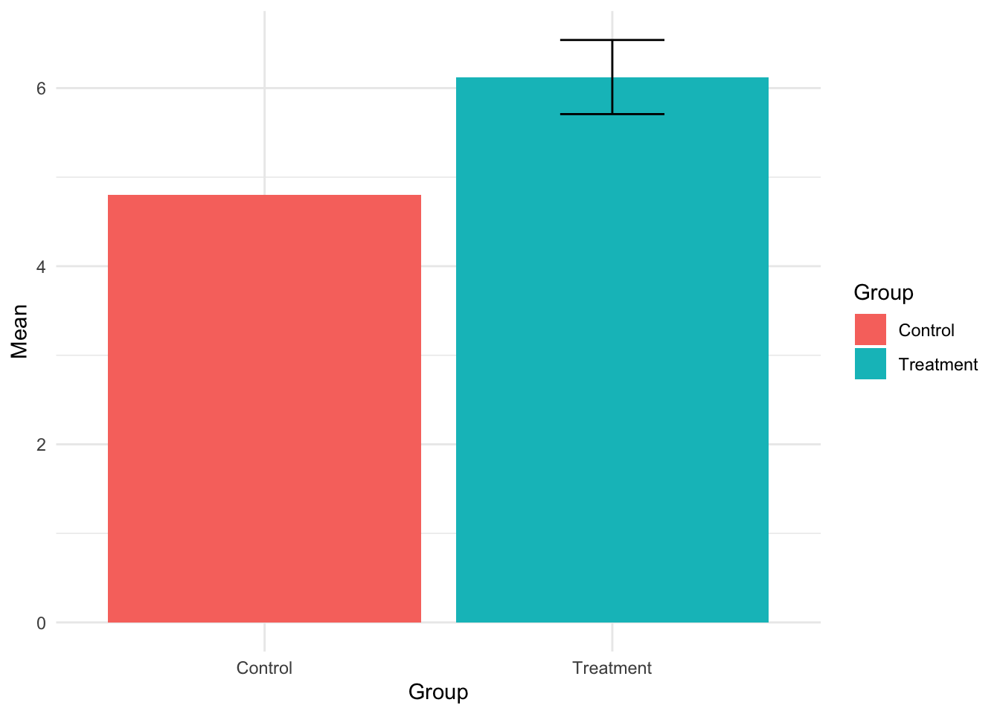
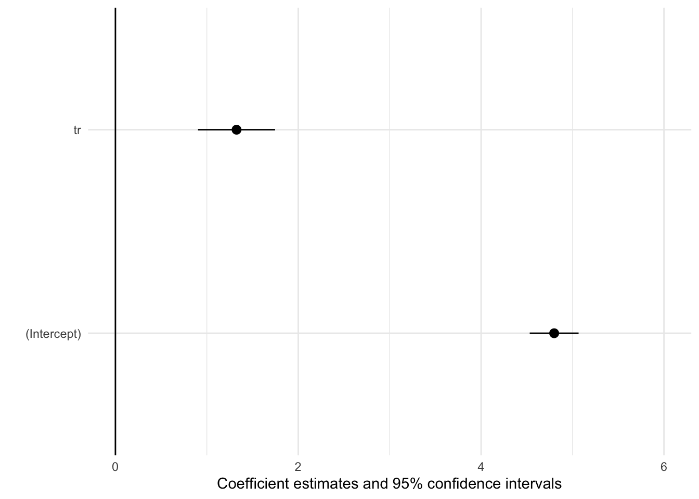
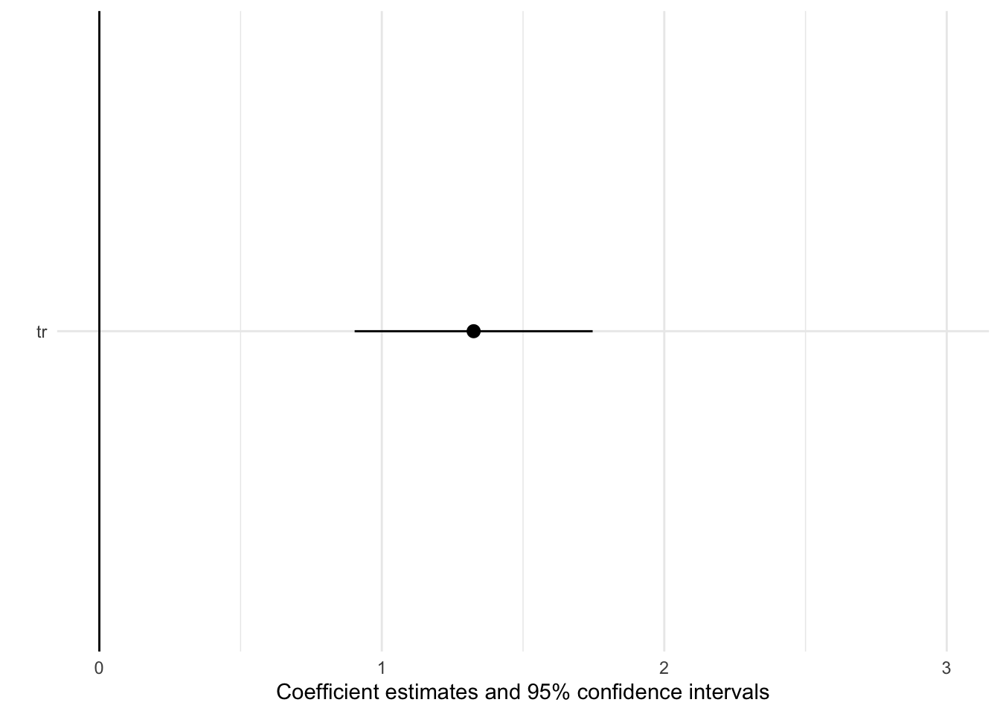

# Publication

Projects generate a variety of types of publications. These may include

- Pre-analysis plans,
- Final technical reports, 
- Public versions of GitHub repositories, 
- Public versions of data, and
- Peer-reviewed academic journal articles. 

## Authorship

As a general rule, we ascribe to the three standards of _substantial contribution_, _approval_, and _accountability_ that _Nature_ lays out [here](https://www.nature.com/nature/editorial-policies/authorship).

1. Every authored Lab document (i.e., academic publications, pre-analysis plans, blog posts, presentations, policy briefs, etc.) should include the following two components:  

- A CREDIT statement that describes the role played by each of the authors for that specific document. Feel free to modify the roles to appropriately reflect the work done. If the document builds significantly on past outputs, those outputs should additionally be cited.  
- "The Footnote" (in papers, usually included as a phrase in the acknowledgments):
  - "Every project of The Lab @ DC is the product of collaboration between many team members, supporting staff, and external partners. The authors, acknowledgements, and CREDIT statement listed here reflect contributions to this document specifically. The details on how we determine authorship and acknowledgements can be found in our Authorship Standard Operating Procedures (link)"

2. Project teams should plan (and Senior Advisors should remind them) to discuss authorship concretely at a project's major inflection points:  
    - When beginning the pre-analysis plan  
    - When finalizing the pre-analysis plan 
    - Under staffing changes (i.e., when project roles change, or team members roll on/off or leave District government)  
    - When beginning data analysis 
    - When beginning drafting a report or academic publication  
    - When finalizing a report or academic publication 

    Whenever possible, these conversations should happen proactively, such that standards for authorship are agreed upon before the work is conducted and documented. Teams can use the internal Sharepoint document "Questions to Help Assess Authorship" as a guide for these conversations.  

3. Our default guidelines are listed below. Project teams can override these guidelines with approval from the Director:  

- The **project co-captain most directly responsible** for the document's analysis and writing should be listed as first author for the publication. Other co-captains or task leads who contributed to the document's analysis and writing should be listed in order of their contributions.  
- The **Director and Senior Advisor^[If the project has had multiple senior advisors, include the one who reviewed the document in question.]** are included as co-authors. If they are only authors by virtue of their reviewing roles, they should be listed last (Director) and second-to-last (Senior Advisor). If they made additional contributions related to design, analysis, or writing, the project team may choose to include their names closer to the beginning of the list.  
- **Agency partners and/or outside academics** will only be listed as co-authors if they substantially contribute to the analysis and/or writing of the paper. Securing funding, reviewing, and/or providing comments is not sufficient to merit co-authorship.  
- **Research assistants** are usually listed in the acknowledgements, but not as authors. The project co-captains may invite them to be a coauthor if they are directly responsible for a substantial portion of the document’s analysis and/or writing.  
- **Additional team members who were not involved in the project at the analysis or writing stage** but contributed substantially to a project’s design and/or implementation may be invited to be a coauthor by the project co-captains. If they are interested in this type of co-authorship, this should be discussed and documented at the time they stop contributing to the project (or, when analysis and writing are begun.) The co-captains may in turn ask for certain additional commitments related to the document. 

4. Co-authors should be given the right to review (which they may decline) before a submission to an academic journal. On academic publications, coauthors are accountable for both their own contributions and for reviewing and vetting the contributions of their co-authors. While co-authors may have different areas of expertise, authorship is attributed at the level of the entire document -- not individual sections or analyses. 

5. When Lab projects generate spinoff papers, authorship is not assumed for anyone involved in the project, and should be discussed when the idea is proposed. If it will involve Lab staff time, the Director should approve the spinoff paper and should make sure expectations about staff time and authorship are clear.  

6. The **Acknowledgements** section of Lab documents should err on the side of inclusion.  

## Publishing Data

We strive to post useful replication data to the extent possible in each project. Some examples of our work doing so include projects on the 911 [nurse triage line](https://github.com/thelabdc/FEMS-911NurseTriageLine-Public) and 457b [enrollment](https://github.com/thelabdc/DCHR-457b-Public).

The federal OPRE has some helpful advice for doing so [here](https://www.acf.hhs.gov/opre/report/guide-publishing-research-data-secondary-analysis).

## Presenting Results

### Estimates and uncertainties

When we want to communicate group estimates along with treatment effects, we display them with barplots or scatterplots. Where we are interested in inference about a treatment effect, we display the control group and treatment group means, with the uncertainty around the treatment group mean representing the uncertainty around the treatment effect. For example, 

When we want to communicate treatment effects without both group means being explicit, we do so with a coefficient plot. For example, with the intercept (control group mean),

or without the intercept,

