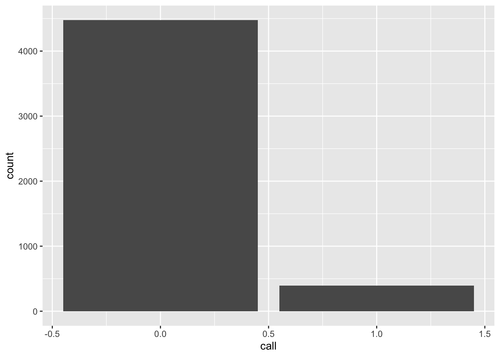

# (APPENDIX) Appendix {-} 

# R Basics

## Get R and RStudio

First download and install R from https://cran.r-project.org.

Then, download and install RStudio (Desktop) from https://posit.co/products/open-source/rstudio/.

(You should have permission for both of these. If not, you may need to contact
EOM IT.)

## Read in data files

We can read data from many formats and many places, including from a local file
or from the web. Many R packages contain their own data.

The code below requires the following packages to be loaded and attached:


```r
library(dplyr)
library(ggplot2)
library(here)
library(lubridate)
library(magrittr)
library(readr)
```

### `.csv`

Data from the web (from the résumé audit experiment from @bermul04):


```r
df_resume <- read_csv("https://raw.githubusercontent.com/kosukeimai/qss/master/CAUSALITY/resume.csv")
```

Then we can examine the dimensions of the new object named `df_resume`:


```r
dim(df_resume)
```

```
## [1] 4870    4
```

So, `df_resume` has 4870 rows and 4 columns. We
can see the first few rows with


```r
head(df_resume)
```

```
## # A tibble: 6 × 4
##   firstname sex    race   call
##   <chr>     <chr>  <chr> <dbl>
## 1 Allison   female white     0
## 2 Kristen   female white     0
## 3 Lakisha   female black     0
## 4 Latonya   female black     0
## 5 Carrie    female white     0
## 6 Jay       male   white     0
```


For data from a local file, if data `mydata.csv` are in subdirectory `/data/`,  


```r
my_data_path <- here("data", "mydata.csv")

df <- read_csv(my_data_path)
```

See
[here](https://thelab.dc.gov/LAB-SOP-experiments/appendix-b-managing-code.html#working-directory-and-relative-paths)
for more detail on how to use `here()` to create paths.

### `.xlsx`

Use package `readxl` and function `read_excel()`. To read the second sheet from
a multi-sheet spreadsheet, add an argument like `read_excel(..., sheet = 2)`.


### Box

To read a file directly from box, we use the `boxr` package. To do so, 

- Have Nathan add you as Box RStudio App collaborator
- Go to dcgov.box.com. At the bottom left, click "Dev Console"
- Click on RStudio Access
- Click the Configuration tab

Here you should see a `client_id` and `client_secret` that you can copy.

Then, run at the R Console


```r
library(boxr)

box_auth(client_id = "<INSERT ID STRING HERE>",
         client_secret = "<INSERT SECRET STRING HERE>")
```

replacing the strings with the information from the Configuration tab.

If R prompts you to update the Renviron file to store this information for next time, you may do so.

Then, your `.R` file that reads the data should include


```r
library(boxr)

box_auth() 
# (arguments can be empty, if credentials stored in Renviron)

df <- box_read("791112121820")
# (where 791112121820 is the Box ID for a .csv to read)
```

For more information, see the `boxr` [vignette](https://r-box.github.io/boxr/articles/boxr.html).

## Pipes

Pipe operators make it easier for humans to follow a code chunk, and they allow
us to string together a sequence of operations into a "pipeline". The standard
pipe from package `magrittr` is most common (`%>%`), but there are others,
including a native R pipe (`|>`).

The pipe simply takes the argument on its left and passes it as the first
argument of the function to its right. So, if I have function `f()` to which I
will pass arguments `x` and `y` (in that order), I can write


```r
f(x, y)
```

Using a pipe, I can equivalently write either


```r
x %>% f(y)
```

or


```r
x |> f(y)
```


## Rename variables

Variable names should adhere to good  [practices](https://thelab.dc.gov/LAB-SOP-experiments/managing-code.html#best-practices). 

The `rename()` function in `dplyr` can rename several variables at once:


```r
df <- df %>% rename(new_var_name_1 = `Bad, old, long, spacey name`,
                    new_var_name_2 = "inconsistentsquishedvarname",
                    new_var_name_3 = starts_with("Unique string old name starts with"))
```

To automatically clean up all the names in a dataframe, the `janitor` package can help:


```r
df <- df %>% clean_names()
```


## Create a New Variable

Suppose I want to create a new variable and attach it to the data frame (i.e.,
to update the data frame to include the new variable). Mechanically, in the
tidyverse I overwrite the old data frame with the new one. Sometimes we want to
use a new name for the augmented data frame, but not when we create each new
variable.

### Create a "wave ID"

A "wave ID" is a variable that is constant for every row in the data set.
Suppose that the resume data were all from "wave 3" of a larger study. To
identify them as such,


```r
df_resume <- df_resume %>% mutate(wave = 3)
```

### Create a primary key

A "primary key" is a variable that uniquely identifies each row in the data set.
To create a primary key or "ID variable",


```r
df_resume <- df_resume %>% mutate(id_var = row_number())
```


### Transform an existing variable

Below, we use the `mutate()` function with the character variable `sex`, which
has levels `female` and `male`, to create a logical `TRUE`/`FALSE` variable
indicating whether the résumé had a putatively female name at the top:


```r
df_resume <- df_resume %>% mutate(isFemale = sex == "female")
```

Now, `df_resume` has 7 columns:


```r
head(df_resume)
```

```
## # A tibble: 6 × 7
##   firstname sex    race   call  wave id_var isFemale
##   <chr>     <chr>  <chr> <dbl> <dbl>  <int> <lgl>   
## 1 Allison   female white     0     3      1 TRUE    
## 2 Kristen   female white     0     3      2 TRUE    
## 3 Lakisha   female black     0     3      3 TRUE    
## 4 Latonya   female black     0     3      4 TRUE    
## 5 Carrie    female white     0     3      5 TRUE    
## 6 Jay       male   white     0     3      6 FALSE
```

Note that `mutate()` needs a dataframe as its first argument. Above, we pass
`df_resume` to `mutate()` using the pipe.

### Create a sum of from subset of variables

Below, we select a subset of columns from `df_resume`, take the sum across them, and add the sum as a new variable. Here, we locate the new variable right after those columns that it summed.


```r
df_resume %>% 
  mutate(new_sum = rowSums(select(df_resume, call:id_var))) %>% 
  relocate(new_sum, .after = id_var)
```

```
## # A tibble: 4,870 × 8
##    firstname sex    race   call  wave id_var new_sum isFemale
##    <chr>     <chr>  <chr> <dbl> <dbl>  <int>   <dbl> <lgl>   
##  1 Allison   female white     0     3      1       4 TRUE    
##  2 Kristen   female white     0     3      2       5 TRUE    
##  3 Lakisha   female black     0     3      3       6 TRUE    
##  4 Latonya   female black     0     3      4       7 TRUE    
##  5 Carrie    female white     0     3      5       8 TRUE    
##  6 Jay       male   white     0     3      6       9 FALSE   
##  7 Jill      female white     0     3      7      10 TRUE    
##  8 Kenya     female black     0     3      8      11 TRUE    
##  9 Latonya   female black     0     3      9      12 TRUE    
## 10 Tyrone    male   black     0     3     10      13 FALSE   
## # … with 4,860 more rows
```


## Recode a variable's values

Instead of creating a new variable as above, we can use `mutate()` and `case_when()` to recode a variable. Suppose we wanted to code race:


```r
df_resume %>% mutate(
  race = case_when(
    race == "white" ~ "race_wh",       # recode "white" to "race_wh"
    race == "black" ~ "race_bl",       # recode "black" to "race_bl"
    race == "missing" ~ NA_character_, # recode "missing" to (character) NA
    TRUE ~ race                        # recode any other value to original value of race
  )
)
```

```
## # A tibble: 4,870 × 7
##    firstname sex    race     call  wave id_var isFemale
##    <chr>     <chr>  <chr>   <dbl> <dbl>  <int> <lgl>   
##  1 Allison   female race_wh     0     3      1 TRUE    
##  2 Kristen   female race_wh     0     3      2 TRUE    
##  3 Lakisha   female race_bl     0     3      3 TRUE    
##  4 Latonya   female race_bl     0     3      4 TRUE    
##  5 Carrie    female race_wh     0     3      5 TRUE    
##  6 Jay       male   race_wh     0     3      6 FALSE   
##  7 Jill      female race_wh     0     3      7 TRUE    
##  8 Kenya     female race_bl     0     3      8 TRUE    
##  9 Latonya   female race_bl     0     3      9 TRUE    
## 10 Tyrone    male   race_bl     0     3     10 FALSE   
## # … with 4,860 more rows
```

There is also `recode()`, but its lifecycle status is "questioning":


```r
df_resume %>% mutate(
  race = recode(race,
    "white" = 0,
    "black" = 1
    )
)
```

```
## # A tibble: 4,870 × 7
##    firstname sex     race  call  wave id_var isFemale
##    <chr>     <chr>  <dbl> <dbl> <dbl>  <int> <lgl>   
##  1 Allison   female     0     0     3      1 TRUE    
##  2 Kristen   female     0     0     3      2 TRUE    
##  3 Lakisha   female     1     0     3      3 TRUE    
##  4 Latonya   female     1     0     3      4 TRUE    
##  5 Carrie    female     0     0     3      5 TRUE    
##  6 Jay       male       0     0     3      6 FALSE   
##  7 Jill      female     0     0     3      7 TRUE    
##  8 Kenya     female     1     0     3      8 TRUE    
##  9 Latonya   female     1     0     3      9 TRUE    
## 10 Tyrone    male       1     0     3     10 FALSE   
## # … with 4,860 more rows
```


## Treat dates as dates

When we have dates stored as character strings, we transform them to dates. First, simulate some date data:


```r
# Simulate date data:
df_resume <- df_resume %>% 
  mutate( 
    dob = paste0(sample(1:12, n(), replace = TRUE), 
                 "/", 
                 sample(1:28, n(), replace = TRUE),
                 "/",
                 sample(1900:2000, n(), replace = TRUE))
)

head(df_resume, 3)
```

```
## # A tibble: 3 × 8
##   firstname sex    race   call  wave id_var isFemale dob       
##   <chr>     <chr>  <chr> <dbl> <dbl>  <int> <lgl>    <chr>     
## 1 Allison   female white     0     3      1 TRUE     4/3/2000  
## 2 Kristen   female white     0     3      2 TRUE     12/16/1944
## 3 Lakisha   female black     0     3      3 TRUE     10/2/1929
```

The tidyverse includes the `lubridate` package. If you know the format of the character strings, there are many shortcut parsers like `mdy()`. Below, we recode character dates to be of date type:


```r
df_resume %>% mutate(
  dob_date = mdy(dob)
)
```

```
## # A tibble: 4,870 × 9
##    firstname sex    race   call  wave id_var isFemale dob        dob_date  
##    <chr>     <chr>  <chr> <dbl> <dbl>  <int> <lgl>    <chr>      <date>    
##  1 Allison   female white     0     3      1 TRUE     4/3/2000   2000-04-03
##  2 Kristen   female white     0     3      2 TRUE     12/16/1944 1944-12-16
##  3 Lakisha   female black     0     3      3 TRUE     10/2/1929  1929-10-02
##  4 Latonya   female black     0     3      4 TRUE     4/20/1956  1956-04-20
##  5 Carrie    female white     0     3      5 TRUE     9/10/1995  1995-09-10
##  6 Jay       male   white     0     3      6 FALSE    2/25/2000  2000-02-25
##  7 Jill      female white     0     3      7 TRUE     7/17/1908  1908-07-17
##  8 Kenya     female black     0     3      8 TRUE     10/10/1912 1912-10-10
##  9 Latonya   female black     0     3      9 TRUE     8/28/1955  1955-08-28
## 10 Tyrone    male   black     0     3     10 FALSE    3/4/1950   1950-03-04
## # … with 4,860 more rows
```

If we aren't sure of the format, or there are several, we use `parse_date_time()` and specify several "orders" of date format. `parse()` functions do their best to use the information in "orders". Below, `"dmy"` alone would recode only the ambiguous dates, assuming they were in day-month-year order. Adding `"%m/%d/%Y"` instructs `parse()` to look for `month/day/year` formats. Finding many that are unambiguously that format, it assumes that format for the new variable. 


```r
df_resume %>% mutate(
  dob_date = as_date(    
    parse_date_time(dob, 
                    orders = c("dmy", "%m/%d/%Y"))
  )
)
```

```
## # A tibble: 4,870 × 9
##    firstname sex    race   call  wave id_var isFemale dob        dob_date  
##    <chr>     <chr>  <chr> <dbl> <dbl>  <int> <lgl>    <chr>      <date>    
##  1 Allison   female white     0     3      1 TRUE     4/3/2000   2000-04-03
##  2 Kristen   female white     0     3      2 TRUE     12/16/1944 1944-12-16
##  3 Lakisha   female black     0     3      3 TRUE     10/2/1929  1929-10-02
##  4 Latonya   female black     0     3      4 TRUE     4/20/1956  1956-04-20
##  5 Carrie    female white     0     3      5 TRUE     9/10/1995  1995-09-10
##  6 Jay       male   white     0     3      6 FALSE    2/25/2000  2000-02-25
##  7 Jill      female white     0     3      7 TRUE     7/17/1908  1908-07-17
##  8 Kenya     female black     0     3      8 TRUE     10/10/1912 1912-10-10
##  9 Latonya   female black     0     3      9 TRUE     8/28/1955  1955-08-28
## 10 Tyrone    male   black     0     3     10 FALSE    3/4/1950   1950-03-04
## # … with 4,860 more rows
```


### Make an age variable 

To make an age variable from the year component, 


```r
df_resume %>% mutate(
  age = 2023 - year(dob_date)
)
```

```
## # A tibble: 4,870 × 10
##    firstname sex    race   call  wave id_var isFemale dob       dob_date     age
##    <chr>     <chr>  <chr> <dbl> <dbl>  <int> <lgl>    <chr>     <date>     <dbl>
##  1 Allison   female white     0     3      1 TRUE     4/3/2000  2000-04-03    23
##  2 Kristen   female white     0     3      2 TRUE     12/16/19… 1944-12-16    79
##  3 Lakisha   female black     0     3      3 TRUE     10/2/1929 1929-10-02    94
##  4 Latonya   female black     0     3      4 TRUE     4/20/1956 1956-04-20    67
##  5 Carrie    female white     0     3      5 TRUE     9/10/1995 1995-09-10    28
##  6 Jay       male   white     0     3      6 FALSE    2/25/2000 2000-02-25    23
##  7 Jill      female white     0     3      7 TRUE     7/17/1908 1908-07-17   115
##  8 Kenya     female black     0     3      8 TRUE     10/10/19… 1912-10-10   111
##  9 Latonya   female black     0     3      9 TRUE     8/28/1955 1955-08-28    68
## 10 Tyrone    male   black     0     3     10 FALSE    3/4/1950  1950-03-04    73
## # … with 4,860 more rows
```

For more precision, the participants' age today, 


```r
df_resume %>% mutate(
  age = as.numeric(
    interval(dob_date, today()), 
    "years")
)
```

```
## # A tibble: 4,870 × 10
##    firstname sex    race   call  wave id_var isFemale dob       dob_date     age
##    <chr>     <chr>  <chr> <dbl> <dbl>  <int> <lgl>    <chr>     <date>     <dbl>
##  1 Allison   female white     0     3      1 TRUE     4/3/2000  2000-04-03  22.9
##  2 Kristen   female white     0     3      2 TRUE     12/16/19… 1944-12-16  78.2
##  3 Lakisha   female black     0     3      3 TRUE     10/2/1929 1929-10-02  93.4
##  4 Latonya   female black     0     3      4 TRUE     4/20/1956 1956-04-20  66.8
##  5 Carrie    female white     0     3      5 TRUE     9/10/1995 1995-09-10  27.4
##  6 Jay       male   white     0     3      6 FALSE    2/25/2000 2000-02-25  23.0
##  7 Jill      female white     0     3      7 TRUE     7/17/1908 1908-07-17 115. 
##  8 Kenya     female black     0     3      8 TRUE     10/10/19… 1912-10-10 110. 
##  9 Latonya   female black     0     3      9 TRUE     8/28/1955 1955-08-28  67.5
## 10 Tyrone    male   black     0     3     10 FALSE    3/4/1950  1950-03-04  73.0
## # … with 4,860 more rows
```

### Make a month-count variable

We may have dates accurate to the day, but we want a count of which month of
participation it is for each participant. Assume that each `firstname` in the
`resume` data represents a participant, and each `dob_date` represents an event
for that participant that we care about. We want to produce a variable that is 0 for the first month of participation (say, February), and 2 for the month two months later (April), regardless of whether the month between (March) appears in the data, and even if participants start or finish participation at very different times.^[If, instead, we want a variable with 1 for the first date for that participant, 2 for the second date, etc., _regardless of how far between the two dates are_, we can use `dplyr::dense_rank()`.]

Below, we group by `firstname`, then round all months to the first date of the month, then count those months (within `firstname`). We show the first three rows for each participant.


```r
df_resume %>% 
  # Ensure ranking _within_ firstname:
  group_by(firstname) %>% 
  # Round all months to first date of the month, then count:
  mutate(dob_month = floor_date(dob_date, unit = "month"), 
         dob_month_count = (min(dob_month) %--% dob_month) %/% months(1)
         ) %>%
  # For presentation, select, arrange, and slice:
  select(firstname, dob, dob_date, dob_month, dob_month_count) %>% 
  arrange(firstname, dob_month_count) %>% 
  slice(1:3)
```

```
## # A tibble: 108 × 5
## # Groups:   firstname [36]
##    firstname dob       dob_date   dob_month  dob_month_count
##    <chr>     <chr>     <date>     <date>               <dbl>
##  1 Aisha     2/2/1900  1900-02-02 1900-02-01               0
##  2 Aisha     2/1/1900  1900-02-01 1900-02-01               0
##  3 Aisha     9/21/1900 1900-09-21 1900-09-01               7
##  4 Allison   1/17/1900 1900-01-17 1900-01-01               0
##  5 Allison   1/22/1900 1900-01-22 1900-01-01               0
##  6 Allison   2/10/1900 1900-02-10 1900-02-01               1
##  7 Anne      2/24/1900 1900-02-24 1900-02-01               0
##  8 Anne      3/20/1900 1900-03-20 1900-03-01               1
##  9 Anne      8/13/1900 1900-08-13 1900-08-01               6
## 10 Brad      5/14/1900 1900-05-14 1900-05-01               0
## # … with 98 more rows
```

If we prefer the first month to be labeled `1` rather than `0`, we just replace
`%/% months(1)` with `%/% months(1) + 1`.

## Create a completely randomised indicator {#sec-create-treatment}

This uses `mutate()`, along with the `sample()` function to create a random
vector of `Treatment`'s and `Control`'s and attach it to `df_resume`:


```r
set.seed(317334706)

df_resume <- df_resume %>% mutate(
  my_new_treatment_assg = sample(c("Treatment", "Control"), 
                                 size = n(), 
                                 replace = TRUE))
```


```r
head(df_resume %>% select(-isFemale, -dob))
```

```
## # A tibble: 6 × 8
##   firstname sex    race   call  wave id_var dob_date   my_new_treatment_assg
##   <chr>     <chr>  <chr> <dbl> <dbl>  <int> <date>     <chr>                
## 1 Allison   female white     0     3      1 2000-04-03 Treatment            
## 2 Kristen   female white     0     3      2 1944-12-16 Control              
## 3 Lakisha   female black     0     3      3 1929-10-02 Treatment            
## 4 Latonya   female black     0     3      4 1956-04-20 Treatment            
## 5 Carrie    female white     0     3      5 1995-09-10 Control              
## 6 Jay       male   white     0     3      6 2000-02-25 Treatment
```


## Plot a variable

Use `ggplot()` to plot the distribution of calls back that these résumés
receive. Calls are fairly rare.


```r
df_resume %>% ggplot(aes(x = call)) + geom_bar()
```



Look at the distribution by the putative race on the resume:


```r
df_resume %>% 
  ggplot(aes(x = call, fill = race)) + 
  geom_bar(position = "dodge2") 
```


Since there are exactly the same number of résumés with each race, these count
distributions are comparable.

## Calculate a data summary

### Proportions for a categorical variable


```r
df_resume %>% count(firstname) %>% mutate(proportion = n / sum(n))
```

```
## # A tibble: 36 × 3
##    firstname     n proportion
##    <chr>     <int>      <dbl>
##  1 Aisha       180    0.0370 
##  2 Allison     232    0.0476 
##  3 Anne        242    0.0497 
##  4 Brad         63    0.0129 
##  5 Brendan      65    0.0133 
##  6 Brett        59    0.0121 
##  7 Carrie      168    0.0345 
##  8 Darnell      42    0.00862
##  9 Ebony       208    0.0427 
## 10 Emily       227    0.0466 
## # … with 26 more rows
```

### Proportions for binary variables


```r
summ_resume <- df_resume %>% 
  group_by(race) %>%
  summarise(call_back_rate = mean(call),         # mean of numeric 0/1
            prop_female = mean(sex == "female")) # mean of logical TRUE/FALSE

summ_resume
```

```
## # A tibble: 2 × 3
##   race  call_back_rate prop_female
##   <chr>          <dbl>       <dbl>
## 1 black         0.0645       0.775
## 2 white         0.0965       0.764
```


The call-back rates differ by about 0.032; the proportion female, which will be balanced by the randomization on average, only differs by about 0.011.

## Merge (join) dataframes

For a fuller treatment of merges ("joins"), see [here](https://r4ds.had.co.nz/relational-data.html#relational-data) in @wicgro16. 

The four main mutating join commands are `left_join()`, `right_join()`, `inner_join()`, and `full_join()`. 

* `left_join(x, y)` keeps all rows of `x`, but only rows of `y` that have matches in `x`
* `right_join(x, y)` keeps all rows of `y`, but only rows of `x` that have matches in `y`
* `inner_join(x, y)` only keeps rows that appear in both `x` and`y`
* `full_join(x, y)` keeps all rows of both `x` and `y`

For any columns that didn't appear in the original dataframe for a certain row, the joins will store `NA`.

By default, joins will match on any columns that have the same name. So, if `age` and `height` are both in `df1` and `df2`, then `full_join(df1, df2)` will consider a row "matched" if the values of both `age` and `height` are the same in the datasets. 

If column names differ, the `by = ...` argument can inform the join. E.g., if, instead, `df1` has variables `Age` and `Tallness`, we could join with 


```r
df_joined <- df1 %>% full_join(df2, 
                               by = c("Age" = "age",
                                      "Tallness" = "height"))
```

Columns with the same name, but different types, will not join. E.g., if `df1$this_var` is numeric, but `df2$this_var` is character, the joins will throw an error.
